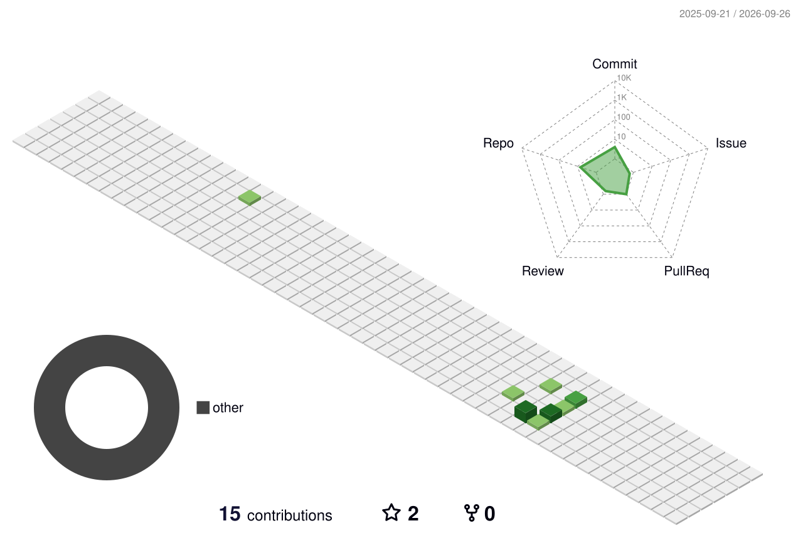

<!-- ============================================================
     GitHub Profile README — Dashboard Style
     Repo: YanyongLiu-coder/YanyongLiu-coder
     ============================================================ -->

  

<!-- TAGLINE -->

  

  
  

  

&nbsp;

**Computer Vision Engineer** specializing in **AI Infrastructure** and **Yard Digital Twin** systems.

I design and deploy real-time multi-camera tracking pipelines for logistics yards — from YOLO detection to cross-camera trajectory association, parking event recognition, and ETID-based vehicle identity binding. My work bridges the gap between CV research and production-grade distributed systems.

- Building **multi-camera tracking systems** with ByteTrack + homography projection
- Designing **container-top occupancy detection** state machines for automated parking events
- Deploying **edge AI inference** across 20+ cameras on GPU clusters with Docker orchestration
- Developing **digital twin** platforms coupling real-time CV with business intelligence

&nbsp;

  
  
  
  
  
  
  
  
  
  
  
  
  
  
  
  

&nbsp;

| | |
|---|---|
| **Yard Digital Twin** | Multi-camera real-time tracking system for logistics yards — YOLO + ByteTrack + cross-camera association + parking detection + journey recording |
| **Global Track Service** | Distributed trajectory management with Kafka pub/sub, homography-based yard projection, and ETID vehicle identity binding |
| **Container Occupancy Detection** | State-machine-driven parking spot monitoring using container-top detection model + 5-feature-point IoU resolver |
| **Multi-Worker Inference Pipeline** | 8-worker GPU inference cluster processing 20+ RTSP camera streams at 18+ fps per camera |

&nbsp;

`Multi-Object Tracking` · `Cross-Camera ReID` · `Homography & Projection` · `Object Detection (YOLO)` · `ByteTrack` · `Real-time Video Analytics` · `Edge AI Deployment` · `Distributed Systems` · `Digital Twin` · `Kafka Streaming` · `State Machine Design` · `Docker Orchestration`

&nbsp;

<!-- 3D Contribution Graph — will appear after running .github/workflows/profile-3d.yml -->
<!-- Uncomment the line below after the first Action run: -->
<!--  -->

&nbsp;

  

&nbsp;

<!-- Snake animation — will appear after running .github/workflows/snake.yml -->
<!-- It generates SVGs on the `output` branch. After first run, uncomment below: -->
<!--
  <picture>
    <source media="(prefers-color-scheme: dark)" srcset="https://raw.githubusercontent.com/YanyongLiu-coder/YanyongLiu-coder/output/github-snake-dark.svg" />
    <source media="(prefers-color-scheme: light)" srcset="https://raw.githubusercontent.com/YanyongLiu-coder/YanyongLiu-coder/output/github-snake.svg" />
    
  </picture>
-->

&nbsp;

